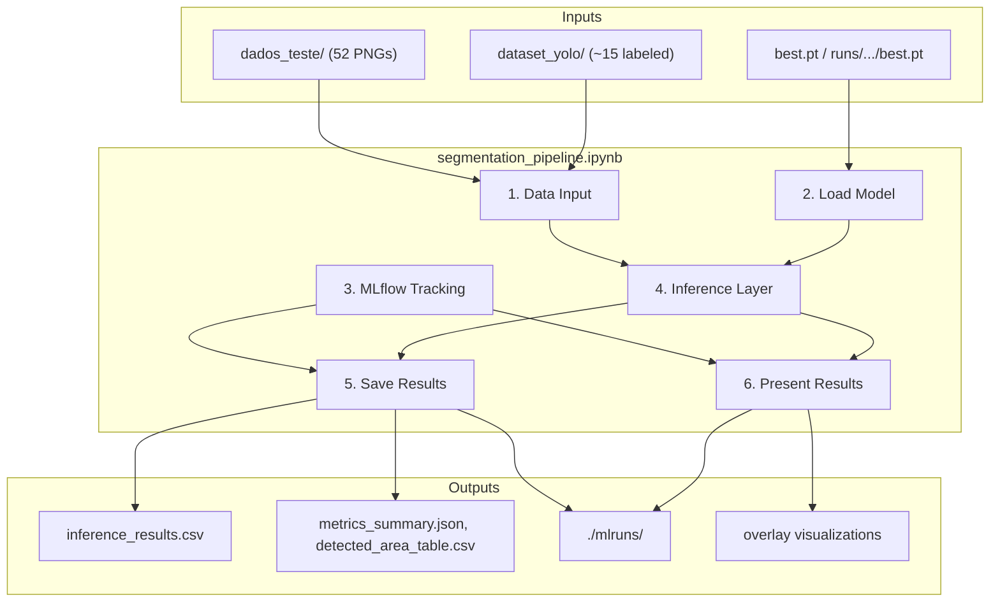

# Solar Panel Segmentation Pipeline

End-to-end inference and evaluation for solar panel segmentation using a trained YOLO model, with experiment tracking via MLflow.

**Main artifact:** [`segmentation_pipeline.ipynb`](segmentation_pipeline.ipynb) — the full pipeline lives in this single notebook.

## Pipeline Architecture



## Requirements

- Python 3.10+
- Packages: `ultralytics`, `opencv-python`, `torch`, `matplotlib`, `pandas`, `tqdm`, `mlflow`, `scikit-learn`

```bash
pip install ultralytics opencv-python mlflow scikit-learn matplotlib pandas tqdm torch
```

## Project layout

| Path | Description |
|------|-------------|
| `dados_teste/` | Inference images (52 PNGs) |
| `dataset_yolo/` | YOLO dataset with labels for evaluation (~15 labeled images) |
| `best.pt` or `runs/train/solar_panels_v1/weights/best.pt` | Trained model weights |
| `segmentation_pipeline.ipynb` | Full pipeline notebook |
| `results/segmentation_pipeline/` | Generated CSV, JSON, and plots |
| `mlruns/` | MLflow experiment store (created on first run) |

## How to run

1. Open a terminal or Jupyter in the project folder:

   ```bash
   cd "gd a revelia"
   ```

2. Ensure the trained weights exist (`best.pt` in the folder, or under `runs/train/solar_panels_v1/weights/`).

3. Open `segmentation_pipeline.ipynb` and **Run All** cells.

4. (Optional) View MLflow UI:

   ```bash
   mlflow ui --backend-store-uri ./mlruns
   ```

   Then open http://127.0.0.1:5000

## Pipeline stages

| Stage | What it does |
|-------|----------------|
| **1. Data Input** | Lists `dados_teste` images and labeled images from `dataset_yolo` |
| **2. Load Model** | Loads YOLO weights; detects native segmentation vs bbox-only |
| **3. MLflow** | Starts a run and logs hyperparameters |
| **4. Inference Layer** | Runs prediction and mask extraction on all images |
| **5. Save Results** | Computes precision, recall, F1; writes metrics and area table; logs to MLflow |
| **6. Present Results** | Overlays, top-6 grid, GT vs prediction on labeled samples |

## Outputs

After a successful run, expect:

| File | Content |
|------|---------|
| `results/segmentation_pipeline/inference_results.csv` | Per-image stats for all `dados_teste` images |
| `results/segmentation_pipeline/metrics_summary.json` | Global precision, recall, F1, confusion matrix |
| `results/segmentation_pipeline/metrics_per_image.csv` | Per-image IoU and TP/FP/FN on labeled set |
| `results/segmentation_pipeline/detected_area_table.csv` | Per-image detected area (pixels, m², estimated kW) |
| `mlruns/` | MLflow runs with the same metrics and artifacts |

## Metrics note

- **Inference** runs on all images in `dados_teste` (52 images).
- **Precision, recall, and F1** are computed only on images that have YOLO labels in `dataset_yolo` (train + val + test, ~15 images). Numeric confusion matrix values are stored in JSON only (no plot).
- **Detected area table** covers all `dados_teste` images, with two didactic visualization examples at the end of the notebook.
- Ground truth masks are built from YOLO bounding-box labels (filled rectangles), matching the bbox-to-mask fallback used when the model is detection-only.

## Related notebooks

- [`segmentation.ipynb`](segmentation.ipynb) — original Portuguese notebook (descriptive stats only)
- [`yolov8_finetuning.ipynb`](yolov8_finetuning.ipynb) — model training
